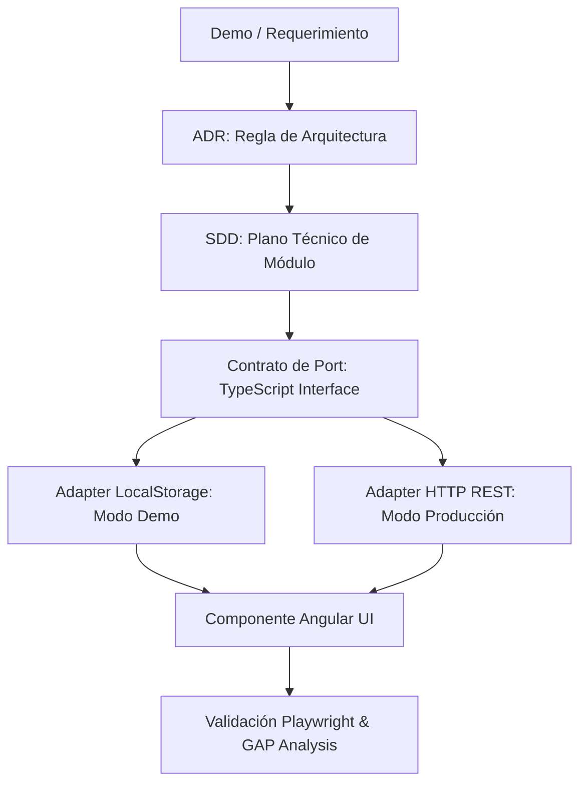

# Metodología SDOP - Syborx

La metodología **SDOP (Spec-Driven / Software Development Operations Protocol)** establece que ningún componente de software se codifica sin una especificación técnica formal y un registro de decisión arquitectónica previo.

## Principios Fundamentales

1. **Spec-First**: Todo desarrollo comienza en `/docs/sdd/` (Software Design Document).
2. **Registro de Decisiones (ADR)**: Cualquier cambio en patrones, librerías o contratos debe documentarse en `/docs/adr/`.
3. **Paridad de Maquetas (GAP Analysis)**: Toda funcionalidad migrada desde una demo o prototipo (`brevemente_demo/`) debe auditarse mediante Playwright y registrarse en `/docs/gap-analysis/`.
4. **Arquitectura Hexagonal (Ports & Adapters)**: La lógica de interfaz y aplicación nunca interactúa directamente con APIs REST o almacenamiento concreto; interactúa mediante interfaces (Ports).

## Flujo de Trabajo SDOP

## Checklist de Calidad SDOP

- [ ] ¿Existe el ADR que respalda la decisión tecnológica?
- [ ] ¿El SDD describe los modelos de datos y estados de la UI?
- [ ] ¿El módulo Angular tiene separados sus `ports/` y `adapters/`?
- [ ] ¿El backend Spring Boot tiene las migraciones Flyway correspondientes?
- [ ] ¿El reporte en `gap-analysis/` certifica la paridad con la demo?
